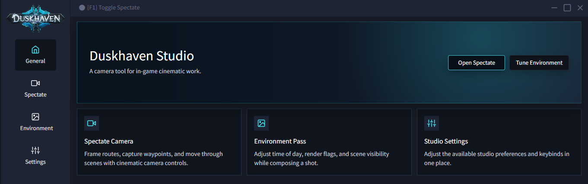

<h1 align="center">
  Duskhaven Studio.
</h1>

<h4 align="center">An open source Machinima tool for WoW machinima makers.</h4>

  <a href="#key-features-">Key Features</a> •
  <a href="#how-to-install">How To Use</a> •
  <a href="#license">License</a>

## Key Features 🎉

* All WoW versions supported from Alpha to Legion
  - Out of the box support for 0.5.3, 0.8.0 ... 1.12.1 ... 2.3.4... 3.3.5a ... 7.3.5
* Built with latest technologies like Electron.js, Vue.js, Bulma.io and Robot.js
* Build complex cinematic scenes with it's built-in editor
* Full control of the environment
* An explorer's dream come true ✨
* Custom spectate camera mode for Alpha and Vanilla

### Features per WoW version:

| Version          | Spectate | Cinematic mode | Environment | Max view distance |
|------------------|----------|----------------|-------------|-------------------   |
| 0\.5\.3          | ✔️       | ✔️             | ⚙️          | ⚙️                 |
| 0\.8\.0          | ✔️       | ✔️             | ⚙️          | ⚙️                 |
| 1\.8\.0          | ✔️       | ✔️             | ⚙️          | ⚙️                 |
| 1\.12\.0         | ✔️       | ✔️             | ⚙️          | ⚙️                 |
| 2\.4\.3          | ✔️       | ✔️             | ⚙️          | ⚙️                 |
| 3\.3\.5a         | ✔️       | ✔️             | ⚙️          | ⚙️                 |
| 4\.3\.4          | ✔️       | ✔️             | ⚙️          | ⚙️                 |
| 5\.4\.8          | ✔️       | ✔️             | ⚙️          | ⚙️                 |
| 6\.2\.3          | ✔️       | ✔️             | ⚙️          | ⚙️                 |
| 7\.2\.5\(24742\) | ✔️       | ✔️             | ⚙️          | ⚙️                 |
| 7\.3\.5\(26972\) | ✔️       | ✔️             | ⚙️          | ⚙️                 |

⚙️ Means that the development of that feature it's not finished yet for that version.

## How To Install

Build or run the project locally from this repository.

Uncompress the file you've download and execute the installer. A desktop short-cut will be created after installation, always open it `as administrator`.

## Contributing

Your contributions are always welcome :). Please have a look at the [contribution guidelines](CONTRIBUTING.md) first. :tada:

## You may also like...

## License

The Unlicense

